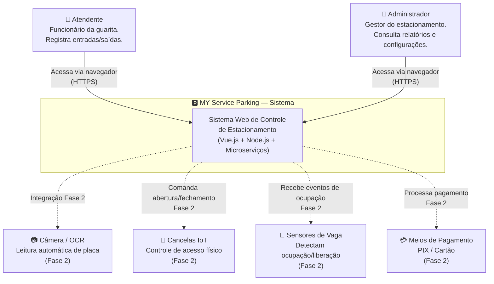
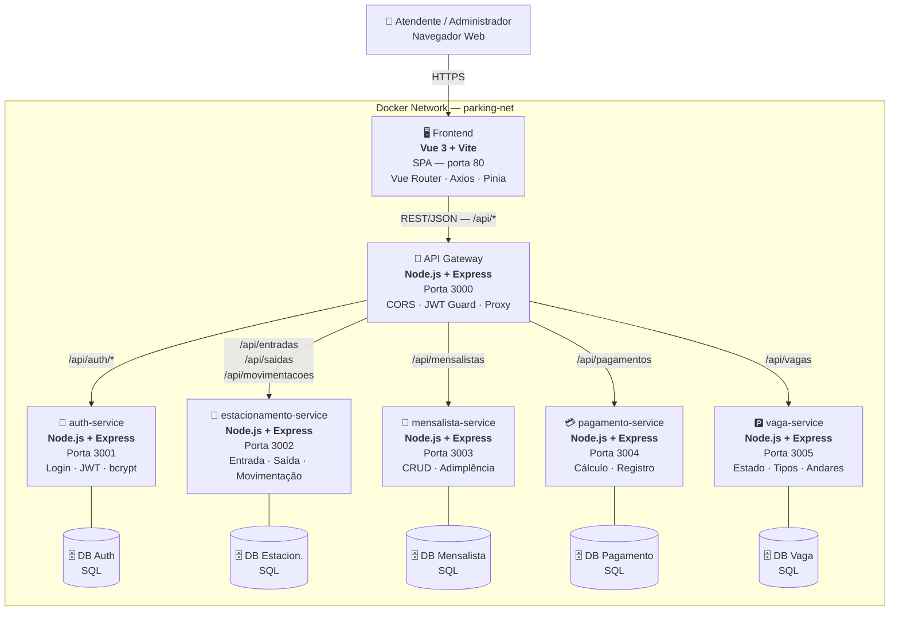
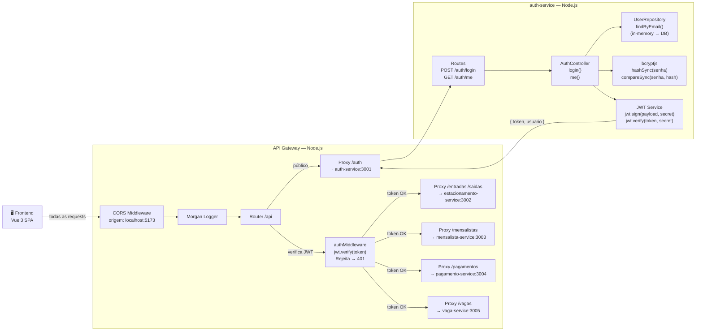
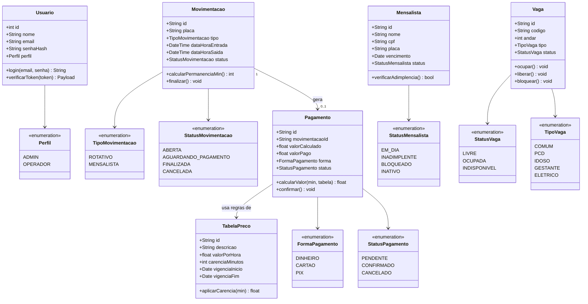

# 🅿️ MY Service Parking

> **Projeto Acadêmico — Arquitetura e Projeto de Software**
> Turma: T2ESOFT05NB | Período: 2026/2

Sistema web de controle de estacionamento para motoristas **rotativos** e **mensalistas**, com arquitetura de microserviços, operação assistida por atendente e integração planejada com dispositivos IoT na Fase 2.

---

## 👥 Equipe de Desenvolvimento

| Dev | Trilha |
|-----|--------|
| **Marcos Vinícius** | Front-end (Vue.js, Router, layout, Views) |
| **Yan** | Back-end (Gateway, microserviços, infraestrutura) |

---

## 📋 Índice

1. [Contexto e Visão do Produto](#1-contexto-e-visão-do-produto)
2. [Público-Alvo](#2-público-alvo)
3. [Requisitos Funcionais](#3-requisitos-funcionais)
4. [Requisitos Não Funcionais Prioritários](#4-requisitos-não-funcionais-prioritários)
5. [Padrão de Arquitetura](#5-padrão-de-arquitetura)
6. [Modelo C4](#6-modelo-c4)
   - [Nível 1 — Contexto do Sistema](#nível-1--contexto-do-sistema)
   - [Nível 2 — Containers](#nível-2--containers)
   - [Nível 3 — Componentes](#nível-3--componentes)
7. [Diagrama de Classes](#7-diagrama-de-classes)
8. [Stack Tecnológica](#8-stack-tecnológica)
9. [Estrutura do Repositório](#9-estrutura-do-repositório)
10. [Como Executar](#10-como-executar)

---

## 1. Contexto e Visão do Produto

### O Problema

Estacionamentos de médio porte dependem de controles manuais (fichas de papel, planilhas) que geram erros de cobrança, dificuldade de rastrear inadimplência de mensalistas e impossibilidade de visualizar a ocupação em tempo real.

### A Solução

O **MY Service Parking** é um sistema web que digitaliza e automatiza o controle completo do estacionamento:

- **Entrada e saída** de veículos registradas por placa via interface web
- **Cálculo automático de tarifa** com carência de 10 minutos
- **Gestão de mensalistas**: cadastro, verificação de adimplência e controle de acesso
- **Painel de vagas** com status em tempo real (livre/ocupada/indisponível)
- **Relatórios e auditoria** para o administrador

### Escopo em Duas Fases

| Fase | Objetivo | Inclui |
|------|----------|--------|
| **Fase 1 — MVP** | Operação assistida pelo atendente, sem dependência de hardware | Login · Entrada/saída por placa · Cálculo de tarifa · Pagamento · Mensalistas · Vagas · Relatórios · Auditoria |
| **Fase 2 — IoT** | Automação com hardware real | Sensores de vaga · Leitura automática de placa · Painéis LED · Abertura automática de cancelas |

> **Regra de ouro:** o MVP não é bloqueado por sensores/cancelas. As interfaces de integração já são projetadas desde o início para facilitar a Fase 2.

---

## 2. Público-Alvo

| Perfil | Descrição | Uso principal |
|--------|-----------|---------------|
| **Atendente / Operador** | Funcionário do estacionamento na guarita | Registra entradas, saídas e pagamentos via EntradaView e SaidaView |
| **Administrador** | Gestor do estacionamento | Consulta relatórios, gerencia mensalistas, vagas e usuários do sistema |
| **Motorista Rotativo** | Cliente avulso sem plano | Seu veículo é registrado pelo atendente; paga na saída |
| **Motorista Mensalista** | Cliente com plano mensal | Acesso verificado automaticamente por placa; pagamento mensal separado |

---

## 3. Requisitos Funcionais

| ID | Requisito | Serviço responsável |
|----|-----------|---------------------|
| RF01 | Registrar entrada de veículo por placa ou ticket | estacionamento-service + integração-dispositivos |
| RF02 | Detectar ocupação/desocupação de vagas por sensores | vaga-service + integração-dispositivos |
| RF03 | Atualizar disponibilidade de vagas nos painéis LED | vaga-service + integração-dispositivos |
| RF04 | Direcionar motoristas para vagas disponíveis | vaga-service + integração-dispositivos |
| RF05 | Controlar abertura e fechamento de cancelas | estacionamento-service + integração-dispositivos |
| RF06 | Calcular valor da permanência (tarifa + carência) | pagamento-service |
| RF07 | Registrar pagamentos (dinheiro, cartão, PIX) | pagamento-service |
| RF08 | Liberar saída do veículo após confirmação do pagamento | pagamento-service + estacionamento-service |
| RF09 | Gerar relatórios de entradas, saídas, ocupação e faturamento | relatorios (via gateway) |
| RF10 | Executar rotina de sincronização e detecção de inconsistências | integração-dispositivos + serviços de domínio |
| RF11 | Gerenciar vagas especiais (PCD, Idoso, Gestante, Elétrico) | vaga-service |
| RF12 | Registrar auditoria de todas as operações administrativas | auth-service + logs |

---

## 4. Requisitos Não Funcionais Prioritários

Os cinco atributos de qualidade com maior impacto na arquitetura do sistema:

### RNF01 — Disponibilidade

> **Meta:** 99,9% de disponibilidade durante o horário de funcionamento (10h–23h).

O sistema não pode ficar indisponível durante a operação do estacionamento, pois bloquearia entradas e saídas de veículos.

**Decisões arquiteturais:**
- Serviços independentes: falha em um serviço não derruba o sistema inteiro
- Health checks em cada microserviço
- Reinicialização automática via Docker (`restart: unless-stopped`)
- Tratamento de erros com respostas 502 no gateway em vez de crash

---

### RNF02 — Desempenho

> **Metas:** Atualização do estado de vaga em **≤ 2 segundos** após evento do sensor. Abertura da cancela em **≤ 5 segundos** após confirmação de pagamento.

Operações críticas do fluxo de atendimento devem ser rápidas para não gerar filas.

**Decisões arquiteturais:**
- Fluxo de cancela evita cadeias longas de chamadas entre serviços
- Comunicação REST síncrona para operações críticas (entrada/saída/pagamento)
- Eventos assíncronos planejados para Fase 2 (sensores IoT)
- Timeout configurado no Axios (10s) para sinalizar falhas ao usuário

---

### RNF03 — Confiabilidade

> **Meta:** Registrar **100%** das entradas, saídas, ocupações e pagamentos, sem perda de dados.

Perda de registro gera inconsistência financeira e impossibilidade de auditoria.

**Decisões arquiteturais:**
- Banco de dados por serviço com transações locais
- Idempotência nas operações críticas (evitar duplo registro)
- Logs estruturados em todos os microserviços
- Reconciliação planejada via `estacionamento-service` (RF10)

---

### RNF04 — Segurança

> **Meta:** Todo acesso administrativo deve ser autenticado. Dados sensíveis devem ser protegidos.

O sistema manipula dados financeiros e de acesso físico ao estacionamento.

**Decisões arquiteturais:**
- Autenticação via **JWT** (JSON Web Token) com expiração de 8h
- Senhas armazenadas com **hash bcrypt** (nunca em texto puro)
- Validação de token centralizada no **API Gateway** antes de repassar para os serviços
- Autorização por **perfil** (ADMIN / OPERADOR) no back-end
- Segredos (JWT_SECRET) em variáveis de ambiente — fora do código-fonte

---

### RNF05 — Escalabilidade

> **Meta:** Suportar adição de novos andares, tipos de vaga e sensores sem modificação do código.

O estacionamento pode expandir fisicamente; o sistema deve acompanhar.

**Decisões arquiteturais:**
- Vagas, andares e tipos modelados como **dados** (banco de dados), não como constantes no código
- Arquitetura de microserviços permite escalar horizontalmente apenas o serviço sobrecarregado
- Camada `integração-dispositivos` isolada do domínio de negócio — novos dispositivos não afetam os serviços core
- `vaga-service` agnóstico a quantidades fixas de vagas

---

## 5. Padrão de Arquitetura

### Padrões Adotados

O projeto utiliza **três padrões arquiteturais complementares**:

#### 5.1 Arquitetura de Microserviços

Cada domínio de negócio é implementado como um serviço independente com banco de dados próprio:

```
auth-service · estacionamento-service · mensalista-service
pagamento-service · vaga-service · (integração-dispositivos — Fase 2)
```

**Por que Microserviços?**

| Vantagem | Impacto no projeto |
|----------|--------------------|
| **Implantação independente** | Cada dev pode evoluir seu serviço sem coordenação de deploy |
| **Isolamento de falhas** | Falha no `pagamento-service` não afeta consulta de vagas |
| **Escalabilidade seletiva** | Escalar apenas o serviço com maior carga (ex: entrada) |
| **Banco por serviço** | Elimina acoplamento via banco de dados compartilhado |
| **Rastreabilidade de domínio** | Cada serviço tem responsabilidade clara e bem definida |

#### 5.2 Padrão API Gateway

Um ponto único de entrada concentra: autenticação JWT, CORS, roteamento e tratamento de erros.

**Por que API Gateway?**

- O front-end conhece apenas **uma URL** (`http://localhost:3000/api`)
- Verificação de JWT **centralizada** — nenhum serviço precisa reimplementar autenticação
- Simplifica CORS, evitando configuração em cada microserviço
- Permite adicionar novos serviços sem alterar o front-end

#### 5.3 SPA (Single Page Application)

O front-end em **Vue.js 3** opera como uma aplicação de página única com Vue Router.

**Por que SPA?**

- O atendente opera em alta frequência — sem recarregamento de página a cada ação
- Vue Router controla toda a navegação no cliente, com guard de autenticação
- Comunicação via Axios com interceptors automáticos (injeção de JWT, tratamento de 401)
- Pinia gerencia estado global de autenticação de forma reativa

### Separação de Responsabilidades (Regra Inviolável)

```
❌ Front-end NÃO calcula tarifa          → pagamento-service calcula
❌ Front-end NÃO decide acesso mensalista → mensalista-service decide
❌ Serviço A NÃO acessa banco do serviço B → comunicação apenas via API
✅ Gateway verifica JWT ANTES de repassar qualquer requisição protegida
```

---

## 6. Modelo C4

### Nível 1 — Contexto do Sistema

Visão de alto nível: quem usa o sistema e com quais sistemas externos ele se integra.



---

### Nível 2 — Containers

Visão dos blocos tecnológicos que compõem o sistema e como eles se comunicam.



---

### Nível 3 — Componentes

Visão interna dos componentes do **API Gateway** e do **auth-service** (serviços centrais da Fase 1).



---

## 7. Diagrama de Classes

Classes do domínio de negócio conforme o modelo C4. Cada classe corresponde a entidades que serão persistidas no banco de dados de seu respectivo microserviço.



---

## 8. Stack Tecnológica

| Camada | Tecnologia | Justificativa |
|--------|------------|---------------|
| Front-end | **Vue 3 + Vite** | Framework progressivo, Composition API, build rápido |
| Navegação | **Vue Router 4** | SPA com guard de autenticação antes de cada rota |
| Estado global | **Pinia** | Store reativo para autenticação (token, usuário, logout) |
| HTTP Client | **Axios** | Interceptors automáticos para JWT e tratamento de 401 |
| API Gateway | **Node.js + Express** | Leve, flexível, ecossistema npm robusto |
| Proxy | **http-proxy-middleware** | Roteamento transparente para microserviços |
| Microserviços | **Node.js + Express** | Uniformidade de stack, facilita trabalho em dupla |
| Autenticação | **jsonwebtoken + bcryptjs** | Padrão de mercado para JWT e hash de senha |
| Banco de dados | **SQL (PostgreSQL/MySQL)** | Integridade relacional para dados financeiros |
| Containerização | **Docker + Docker Compose** | Ambiente reproduzível para desenvolvimento e entrega |
| Versionamento | **Git + GitHub** | Controle de versão com Pull Requests e revisão em dupla |

---

## 9. Estrutura do Repositório

```
MY_SP/
├── frontend/                        # Vue 3 + Vite (SPA)
│   ├── src/
│   │   ├── router/index.js          # Rotas + guard JWT
│   │   ├── services/api.js          # Axios com interceptors
│   │   ├── stores/auth.js           # Pinia — estado de auth
│   │   ├── components/AppLayout.vue # Layout base com menu
│   │   └── views/                   # 8 telas da aplicação
│   ├── Dockerfile
│   └── nginx.conf
│
├── gateway/                         # API Gateway Node.js
│   └── src/
│       ├── app.js                   # Express + CORS + morgan
│       ├── routes/index.js          # Proxy para microserviços
│       └── middleware/auth.js       # Verificação JWT
│
├── services/
│   ├── auth-service/                # Login + JWT (funcional)
│   ├── estacionamento-service/      # Entrada/saída/movimentação
│   ├── mensalista-service/          # CRUD mensalistas
│   ├── pagamento-service/           # Cálculo e registro
│   └── vaga-service/                # Estado das vagas
│
├── docs/
│   └── api-contracts.md             # Contratos request/response
├── REGRAS_DE_NEGOCIO.md             # Regras de negócio detalhadas
├── docker-compose.yml               # Orquestração de containers
└── README.md                        # Este documento
```

---

## 10. Como Executar

### Pré-requisitos
- Node.js 20+
- npm 10+
- Docker + Docker Compose (opcional)

### Opção 1 — Desenvolvimento Local

```bash
# Terminal 1 — auth-service
cd services/auth-service
npm run dev        # porta 3001

# Terminal 2 — API Gateway
cd gateway
npm run dev        # porta 3000

# Terminal 3 — Frontend
cd frontend
npm run dev        # http://localhost:5173
```

**Credenciais de teste:**

| Perfil | Email | Senha |
|--------|-------|-------|
| Admin | admin@myparking.com | admin123 |
| Operador | operador@myparking.com | op123 |

### Opção 2 — Docker Compose

```bash
docker compose up --build
```

| Serviço | URL |
|---------|-----|
| Frontend | http://localhost |
| Gateway | http://localhost:3000 |
| auth-service | http://localhost:3001 |
| estacionamento-service | http://localhost:3002 |
| mensalista-service | http://localhost:3003 |
| pagamento-service | http://localhost:3004 |
| vaga-service | http://localhost:3005 |

---

## 📚 Referências do Projeto

- [`REGRAS_DE_NEGOCIO.md`](./REGRAS_DE_NEGOCIO.md) — Regras de negócio completas (RN-01 a RN-24)
- [`docs/api-contracts.md`](./docs/api-contracts.md) — Contratos de API (request/response)
- `MY_Service_Parking_Arquitetura_e_Plano_de_Desenvolvimento.pdf` — Documento técnico de arquitetura

---

*Desenvolvido por Marcos Vinícius e Yan — T2ESOFT05NB | Projeto e Arquitetura de Software | 2026*
